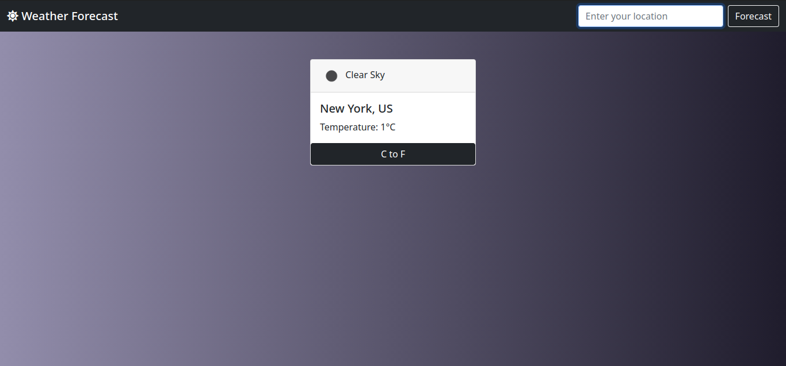

# Weather App

> This  weather app lets you get the weather data of any city in the world.

## Built With

- HTML & CSS
- Bootstrap
- Javascript

## Live Demo

[Weather App](https://meronokbay.github.io/weather-app/)

## Getting Started

### Prerequisites

- npm
- node

### Install

1. Clone the repo.
1. Run `npm install` in the root of this project to install all the necessary dependencies.
1. Go to your browser and open `dist/index.html` in the cloned repo.

## Authors

👤 **Meron Ogbai**

- Github: [@meronokbay](https://github.com/meronokbay)
- Twitter: [@MeronDev](https://twitter.com/MeronDev)
- Linkedin: [Meron Ogbai](https://linkedin.com/in/meron-ogbai/)

## 🤝 Contributing

Contributions, issues, and feature requests are welcome!

## Show your support

Give a ⭐️ if you like this project!

## 📝 License

This project is [MIT](lic.url) licensed.
